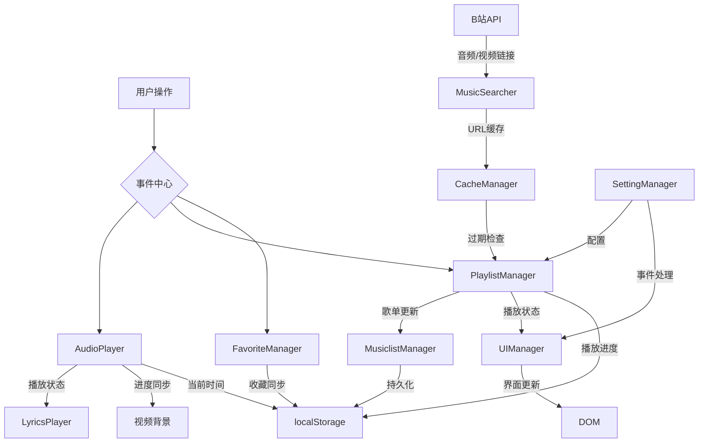

# NB Music


## 简介
由NB-Group和User782Tec两名初中生开发的跨平台音乐播放器！无需VIP就能畅听全网音乐，因为我们直接从哔哩哔哩获取音频资源~ 
这里有：
- 全网音乐自由播放（包括其他平台要VIP的歌曲！）
- 一键导入B站收藏夹当歌单
- 智能歌词捕捉系统（自动匹配+手动补全双保险）
**初中生の黑科技宣言**：我们才不是只会做题的小可爱！用Electron+各大API，带你体验真正的白嫖听歌自由ψ(｀∇´)ψ

哦，对了！我们基于以下开源项目，感谢他们！
- [neteasecloudmusicapi](https://gitlab.com/Binaryify/neteasecloudmusicapi) 网易云API(Github仓库已经寄了)
- [BillBill Api Collect](https://github.com/SocialSisterYi/bilibili-API-collect) B站API
---

## 用户指南

### 下载
[Releases](https://github.com/NB-Group/NB_Music/releases)查看最新版本喵！
话说应该会有自动更新的，代码里写了的（）
### 特色功能说明书
**B站相关**  
- 我们从B站自动抓取最高音质版本（悄悄说：登录带大会员的账号才能听Hi-Res的QwQ）
- 收藏夹一键导入歌单（一点迁移成本都没有哦）

**歌词相关**
- 从网易云自动抓取歌词捏。  
- 自动匹配歌词的不对？你可以手动歌名（然后我们再去全网搜刮~记得在设置里打开哦）

**🛠️ 遇到问题怎么办？**  
- 歌曲加载失败→多点几次播放键（我们的重试机制超顽强！）
- 其他bug→对着屏幕说"修好它！"（然后重启应用就OK啦~才怪！要记得反馈给我们哦）
- 当然，修bug最重要的还是重启应用啦！

---

## 开发者文档

### 架构设计


#### 技术栈

- 🚀 Electron - 跨平台桌面应用开发框架
- 🎵 Web Audio API - 音频处理
- 🎨 原生 CSS - 界面样式
- 📦 Yarn - 包管理器
- 🔄 GitHub Actions - CI/CD
#### 核心模块
```bash
.
├── .github/                     # GitHub 相关配置
│   └── workflows/              # GitHub Actions 工作流配置
│       └── release.yml         # 自动发布配置
├── icons/                      # 应用图标资源
│   ├── icon.icns              # macOS 图标
│   ├── icon.ico               # Windows 图标
│   └── icon.png               # 通用图标
├── img/                        # 图片资源文件夹
│   └── NB_Music.jpeg            # 海报图片
├── src/                       # 源代码目录
│   ├── components/            # 组件文件夹
│   │   ├── AudioPlayer.js     # 音频播放器核心组件
│   │   ├── LyricsPlayer.js    # 歌词同步和显示组件
│   │   ├── PlaylistManager.js # 播放列表管理
│   │   ├── UIManager.js       # UI界面管理
│   │   ├── MusicSearcher.js   # 音乐搜索功能
│   │   ├── FavoriteManager.js # 收藏夹管理
│   │   └── CacheManager.js    # 缓存管理
│   ├── main.html              # 主窗口HTML
│   ├── main.js                # 主进程入口文件
│   ├── script.js              # 渲染进程主脚本
│   ├── style.css             # 全局样式表
│   └── utils.js              # 工具函数
├── neteasecloudmusicapi/     # 网易云音乐API(子模块)
├── .gitattributes            # Git属性配置
├── .gitignore                # Git忽略配置
├── .prettierrc               # 代码格式化配置
├── package.json              # 项目配置和依赖
├── eslint.config.mjs         # ESLint配置
└── README.md                 # 项目说明文档
```

#### 数据流向


### 贡献指南
1. 克隆仓库后执行 `yarn add --magic`（开玩笑的，正常add就好）
2. 调试主进程：`yarn run electron:debug`
3. 直接运行: `yarn run run`
4. 打包: `yarn run build`
5. 代码规范：
   - 一定要组件化哦！面向对象启动！
   - 用yarn！
   - 其它没啥，代码合理即可。
   - 求大佬PR（雾）
6. 提PR时请附上猫耳表情包以通过审核（大雾）

---

**版权说明**  
开源协议：[GPL-3.0](LICENSE) 
开发团队：NB-Group和User782Tec这两名初中生（作业没写完也要写代码的传说！）（其实我们成绩都很好的啦）

尽管我们代码开源，但我们仍受《中华人民共和国著作权法》的保护。
禁止一切使用我们源代码的商业行为，包括但不限于，打包售卖、未经允许的搬运等。
（上次我们的Win12就被倒卖源码了QwQ）
如果用于学习交流，那么请便，但是务必标注作者和项目链接哦。

其它条款请见 [GPL-3.0](LICENSE) 协议文本。